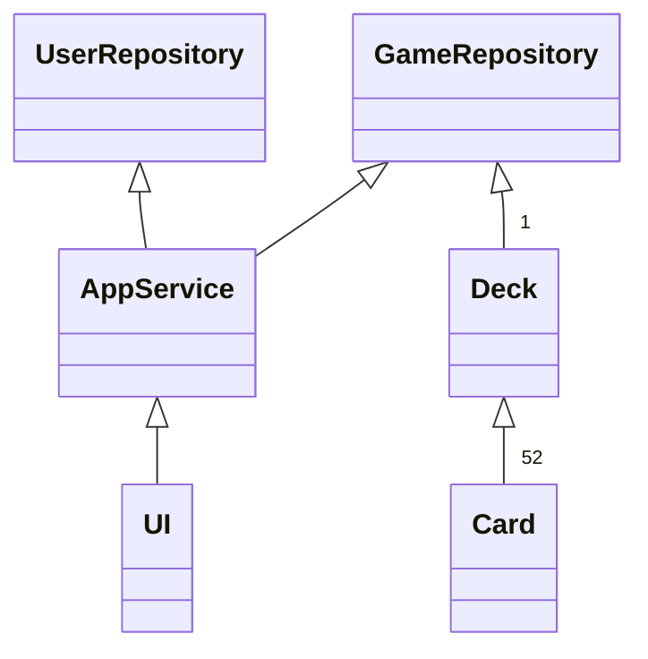
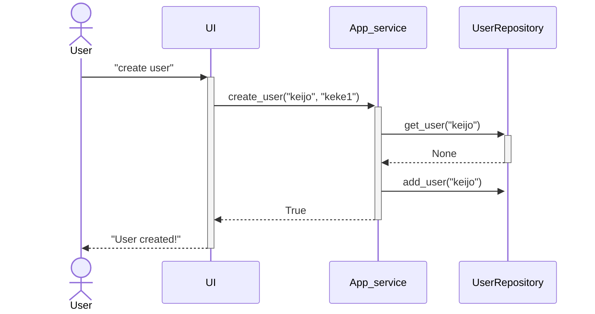

# Architecture

## Class diagram

```mermaid
 classDiagram
    AppService <|-- UI
    UserRepository <|-- AppService
    GameRepository <|-- AppService
    GameRepository <|-- "1" Deck
    Deck <|-- "52"Card
```

# User creation sequence diagram

```mermaid
    sequenceDiagram
        actor User
        User->>+UI: "create user"
        UI ->>+ App_service: create_user("keijo", "keke1")
        App_service ->>+ UserRepository: get_user("keijo")
        UserRepository -->>- App_service: None
        App_service ->>+ UserRepository: add_user("keijo")
        App_service -->>- UI: True
        UI-->>-User: "User created!"
```