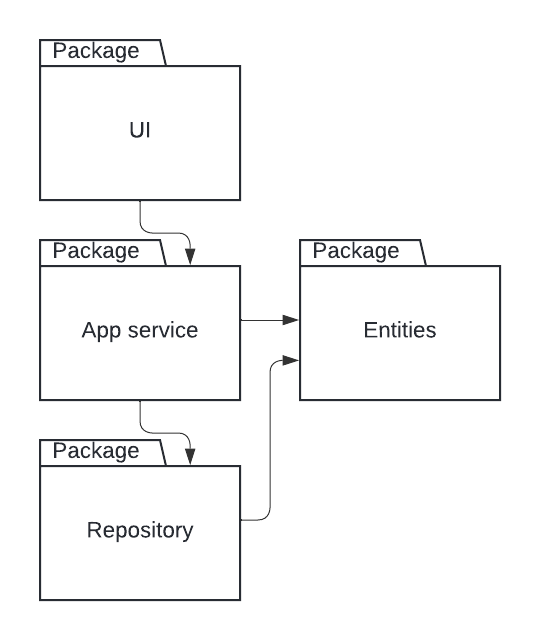
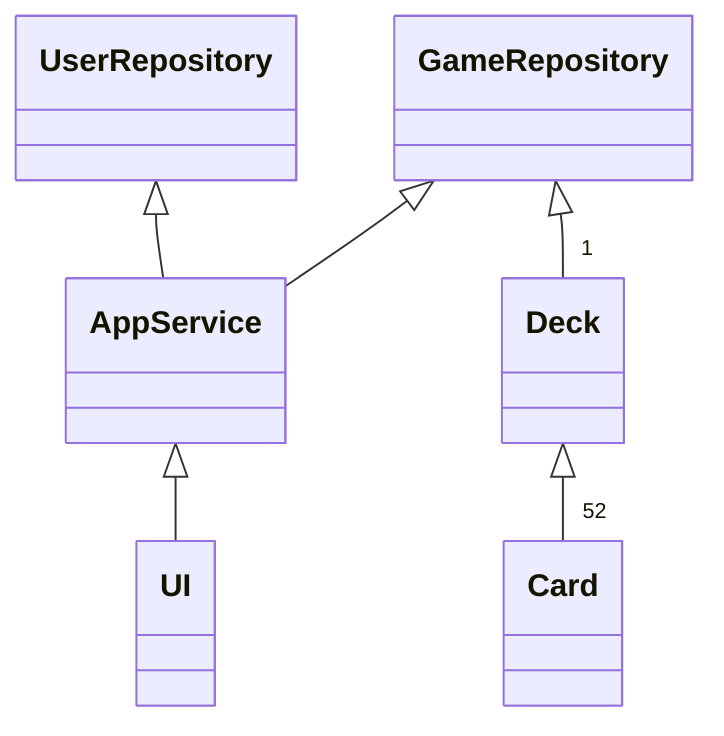
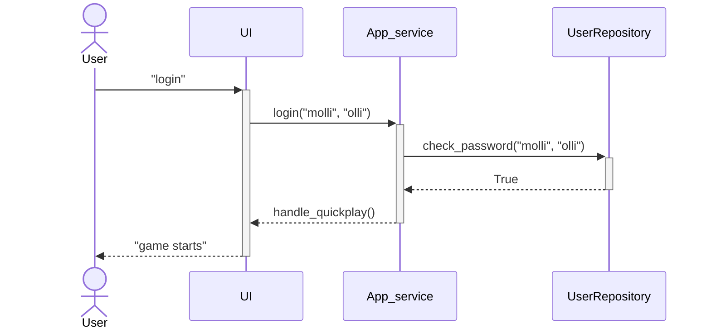
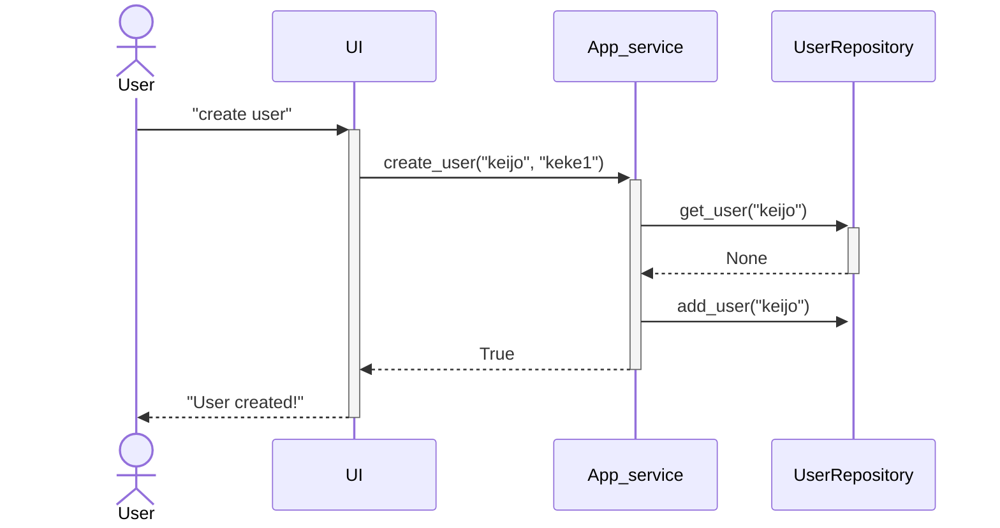
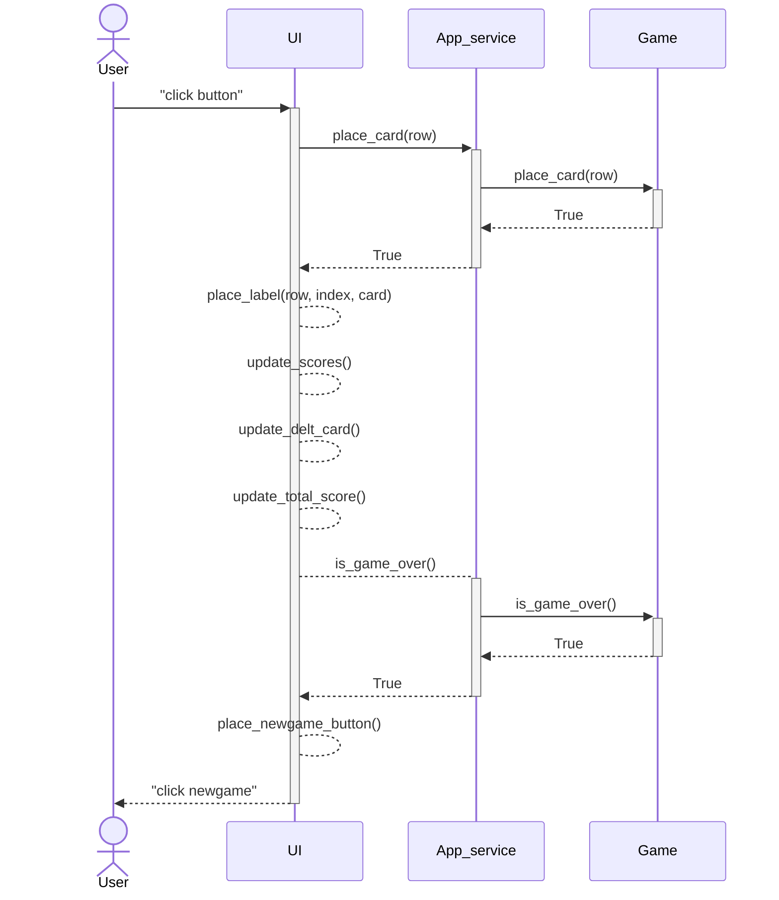

# Architecture

## Structure

The application has three layers, UI, service and repositories. The package UI contains the user interface, in the service is responsible of logic and through repository packet is the interface to the database.

## UI

### Views

+ login 
+ createuser
+ gameselection
+ game
+ info
+ gameover

The class UI handles the change between views. Loginview contains way to login, change to createuser view and quickplay option without logging in. After the user selects quick game or logs in game selection view is shown. In the game view is the main usage of the application. Game view contains transition to info view. When the game is over gameover view is shown with player stats, top scores etc.

### Service

The service class is a bridge between the UI and repository

### Repository

UserReposotory class handles sql queries to the database. 

## Class diagram

## Functionality

Diagrams from main functionality of the game. User creates username and then logs in to the game.

### user Login sequence diagram

### User creation sequence diagram

Sequence diagram for user creation.

### Placing the last card sequence diagram

Sequence diagram for user placing the last card to the game.

