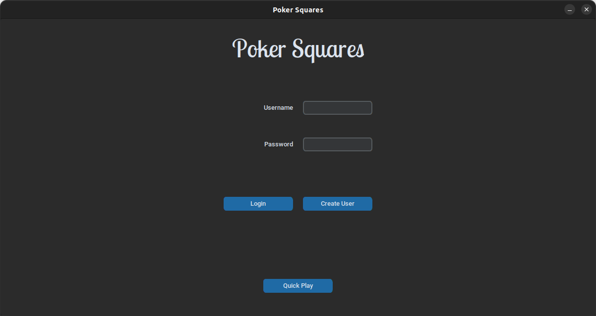
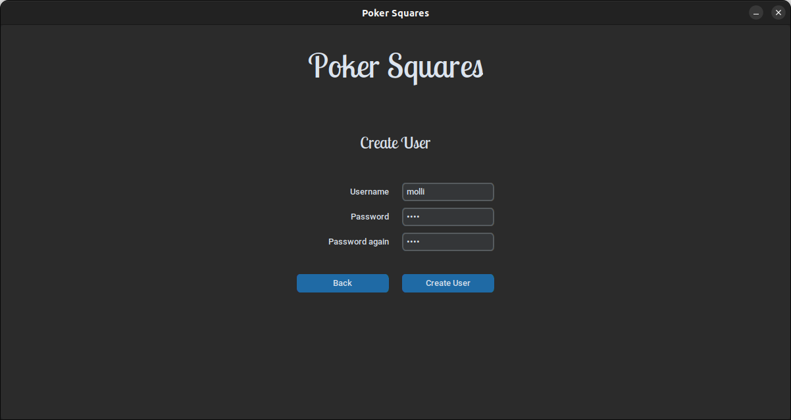
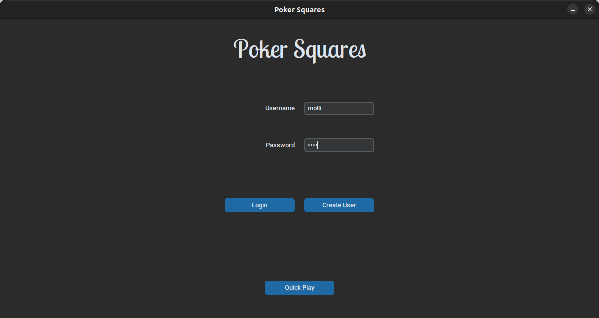
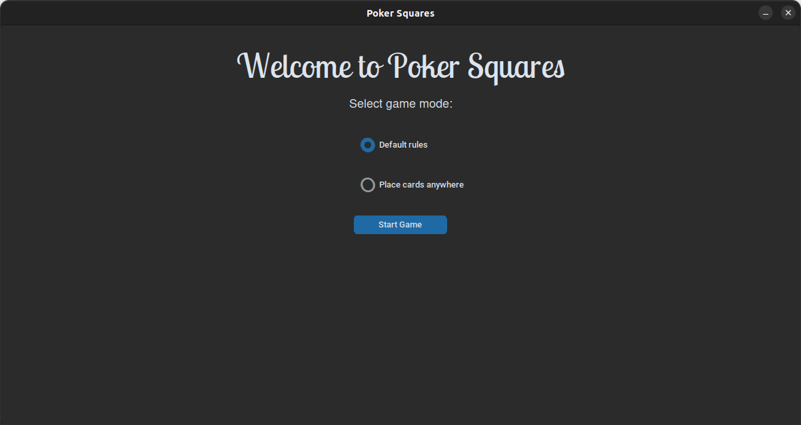
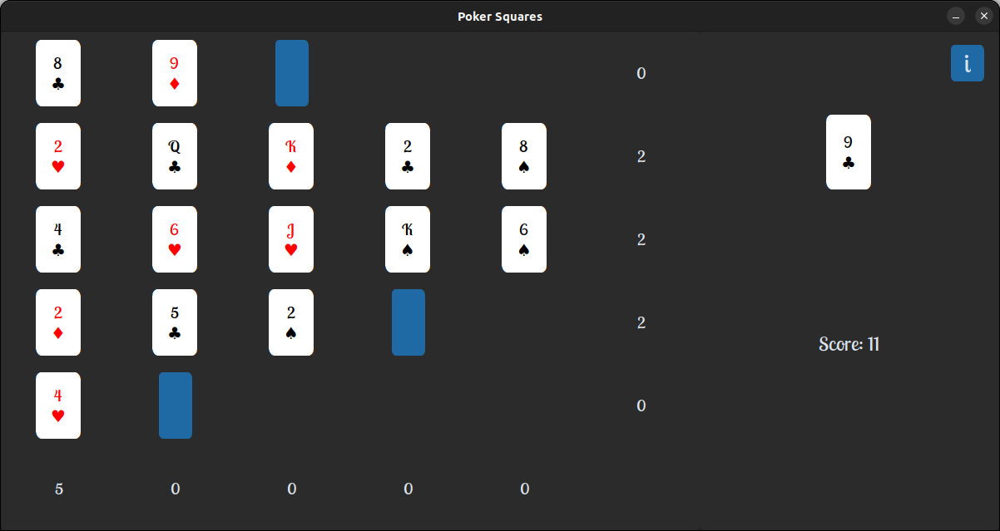
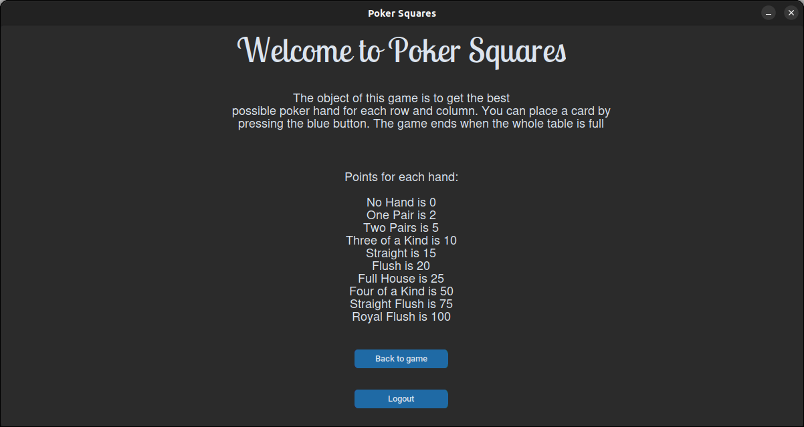
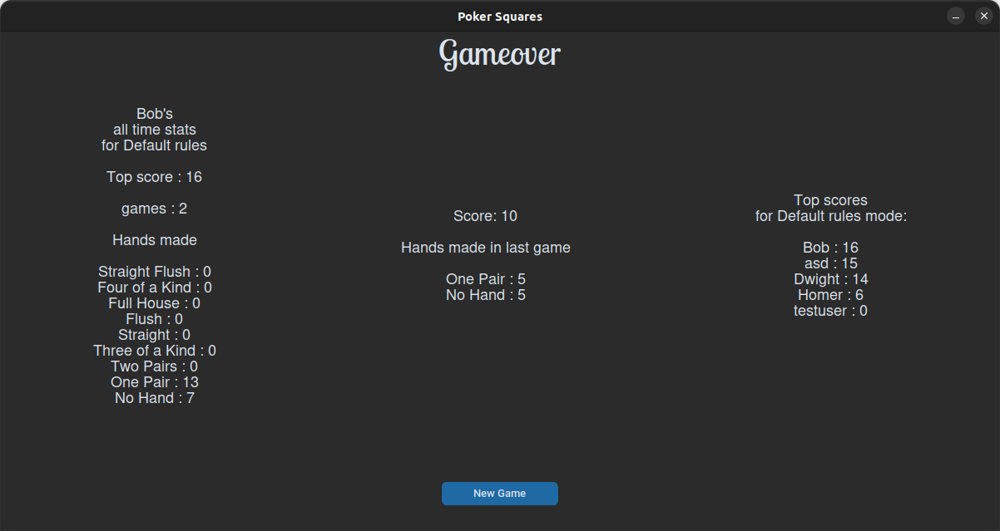

# UserManual

Download the newest [release](https://github.com/Badding/ot-harjoitustyo/releases), click  __Source code__ from __Assets__

### Configure

User data is stored in a database. To change the default name of the database you can modify the .env file in the database directory.
```bash
DATABASE_FILENAME=database.sqlite
```

### Installation

To Install dependencies 
```bash
poetry install
```
Run before starting the app to initialize the database
```bash
poetry run invoke build
```
Run app
```bash
poetry run invoke start
```

## To play quick game without user account

In the login screen click "Quick play"



## Create new user

In the login screen click "Create User"

Enter User name and repeat password to both password fields. Click "Create User"
If User was created successfully a "User created!" message appears.
Click "Back" to go back to login screen. 



## Login to game

Enter user name and password and click login



## Select gamemode

Here you can select different ruleset. In the default rules the cards can only be placed to the end of each row. In the Place card anywhere mode, you can freely place the card on any free spot on the board.



## Gameplay

The object of this game is to get the best possible poker hand for each row and column. You can place a card by pressing the blue button. The game ends when the whole table is full




## Help screen and logout

To access help screen press the "I" button on top right of the game screen. This screen shows info and info how scoring works in the game.
To logout, click "Logout". User returns to login screen.



## Gameover

After the game is over the stat screen is shown with players all time statics and top scores of all the players.


