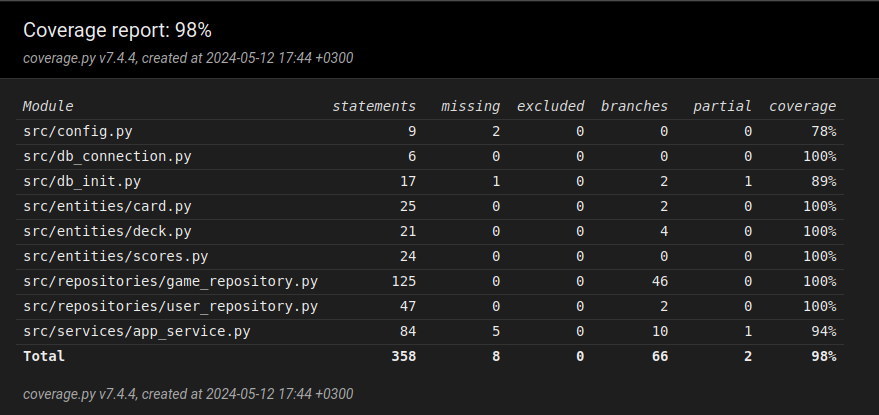

# Testing Document

Testing is carried out using automated test tools. Strategy includes unit tests, integration tests. 

## Unit and Integration Tests

The `Game`-class responsible for the game logic is tested in [TestPokerSquares](..\src\tests\game_repository.py)-test class.
The `UserRepository`-class handling user related tasks are tested in [TestUserRepository](..\src\tests\user_repository.py)-test class.
The `AppService`-class is tested in [TestGameAppService](..\src\tests\app_service_test.py)-test class.

### Entity Tests
`Card`-class that represents a playing card is tested in [TestCard](..\src\tests\card_test.py)-test class.
`Deck`-class that represents a deck of playing cards is tested in [TestDeck](..\src\tests\deck_test.py)-test class.
`Scores`-class is tested at the same time with other tests

## Test Coverage

Excluding UI, the application testing has a branch coverage of 98%.

Test left out in `AppService`-class has been already tested in the `TestUserRepository`-class

## End-to-End Tests

End-to-End tests are not automated and are done by testing the application manually.

### Installing and configuring

All testing done on Linux-environment

All functuonalities listed in the requirement specification document and the usermanual has been tested by either automated testes or manually. Creating a new user is the only place where user can insert inputs. These input fields are checked so they can't be empty and/or invalid values.

### Issues

+ The database needs to be initialized by a command.
+ .env.test stopped working on the last day of the project. No longer using a test database