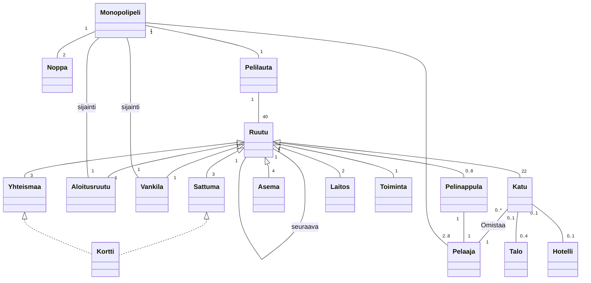

```mermaid
 classDiagram
    Monopolipeli "1" -- "2" Noppa
    Monopolipeli "1" -- "1" Pelilauta
    Pelilauta "1" -- "40" Ruutu
    Ruutu "1" -- "1" Ruutu : seuraava
    Ruutu "1" -- "0..8" Pelinappula
    Ruutu <|-- "1" Aloitusruutu
    Ruutu <|-- "1" Vankila
    Monopolipeli -- "1" Vankila : sijainti
    Monopolipeli -- "1" Aloitusruutu : sijainti
    Ruutu <|-- "3" Yhteismaa
    Ruutu <|-- "3" Sattuma
    Ruutu <|-- "4" Asema
    Ruutu <|-- "22" Katu
    Ruutu <|-- "2" Laitos
    Ruutu "1" -- "1" Toiminta 
    Katu "0..*" -- "1" Pelaaja : Omistaa
    Katu "0..1" -- "0..4" Talo
    Katu "0..1" -- "0..1" Hotelli
    Pelinappula "1" -- "1" Pelaaja
    Pelaaja "2..8" -- "1" Monopolipeli
    Sattuma <|.. Kortti
    Yhteismaa <|.. Kortti
```
