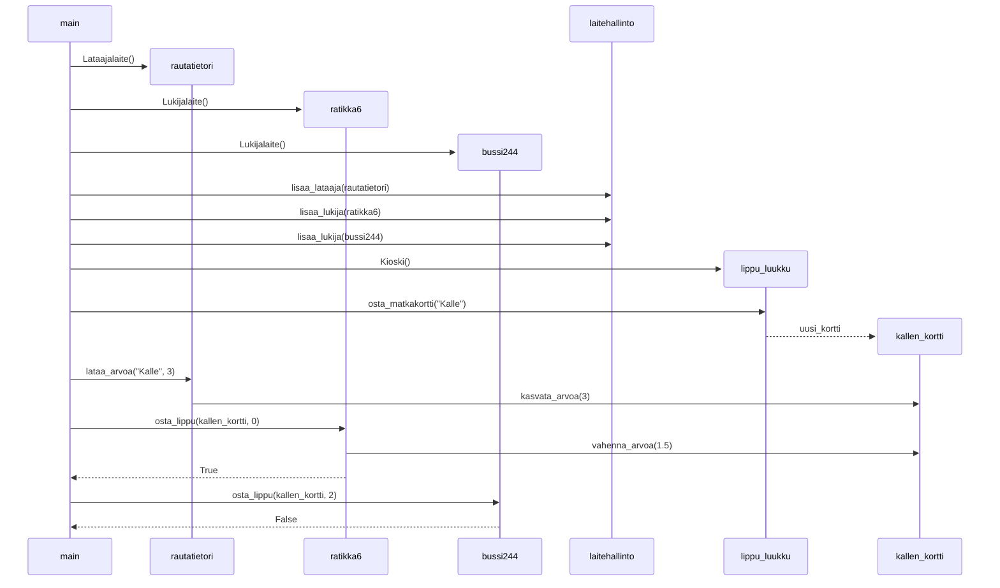

```mermaid
sequenceDiagram
    participant M as main
    create participant rautatietori
    M ->> rautatietori: Lataajalaite()
    create participant ratikka6
    M ->> ratikka6: Lukijalaite()
    create participant bussi244
    M ->> bussi244: Lukijalaite()
    participant L as laitehallinto
    
    M ->> L: lisaa_lataaja(rautatietori)
    M ->> L: lisaa_lukija(ratikka6)
    M ->> L: lisaa_lukija(bussi244)

    create participant ll as lippu_luukku
    M ->> ll: Kioski()

    M ->> ll: osta_matkakortti("Kalle")
    create participant kk as kallen_kortti
    ll -->> kk: uusi_kortti

    M ->> rautatietori: lataa_arvoa("Kalle", 3)
    rautatietori ->> kk: kasvata_arvoa(3)

    M ->> ratikka6: osta_lippu(kallen_kortti, 0)
    ratikka6 ->> kk: vahenna_arvoa(1.5)
    ratikka6 -->> M: True

    M ->> bussi244: osta_lippu(kallen_kortti, 2)
    bussi244 -->> M: False
```